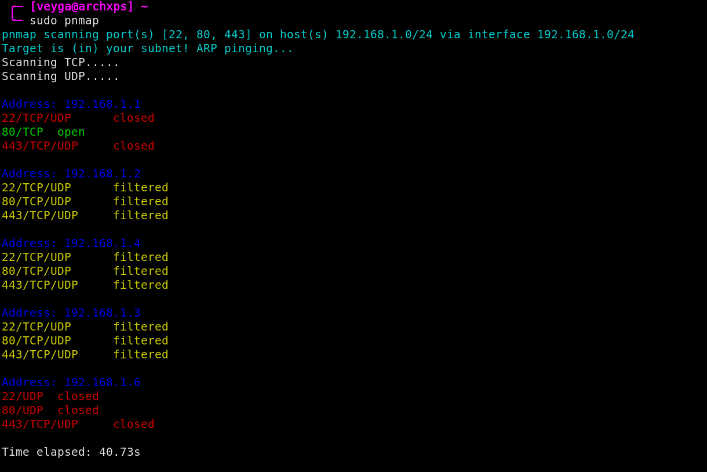
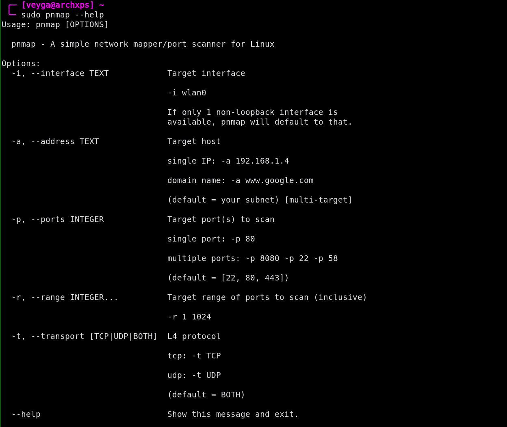

# pnmap
A simplified Python implementation of nmap (network mapper/port scanner).


## Features

- Quick and easy multi-target subnet scans.
- Single target external scans.
- UDP and TCP scans.
- Often [faster](benchmarks.pdf) than nmap for simple scans, due to program simplicity.

## Installation
``` pip3 install pnmap ```

## Usage
- For quick subnet scans:
```sudo pnmap```
- For additional configuration, utilize help menu:
``` pnmap --help ```

- See [outputs](https://github.com/veyga/pnmap/tree/master/output) for specific use cases.

## Additional Information
- As pnmap utilizes packet injection, it must be run as sudo
- Due to network briding, pnmap does not work deterministically inside VM's (e.g. Virtualbox, VMWare)
- Results which return as "closed" implies the port returned a response
- Results which return "filtered" are due to connection issues or are filtered by a firewall.

## Screenshots
<i>Subnet Scan</i></br></br>

</br>

<i>Help</i></br></br>

</br>
